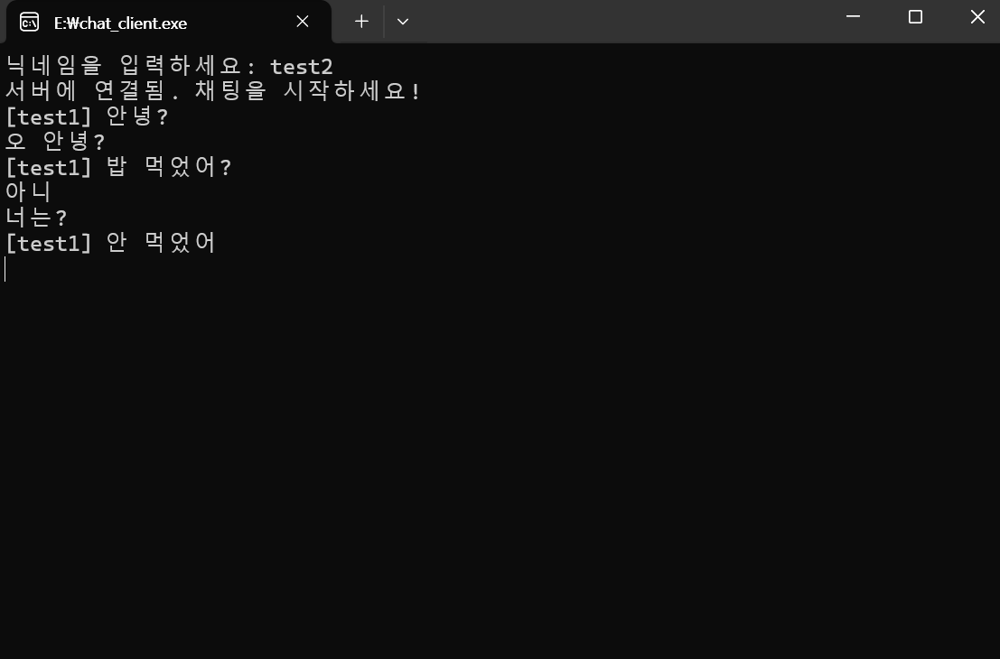
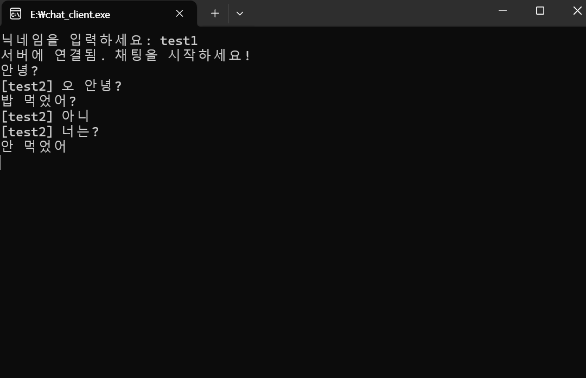
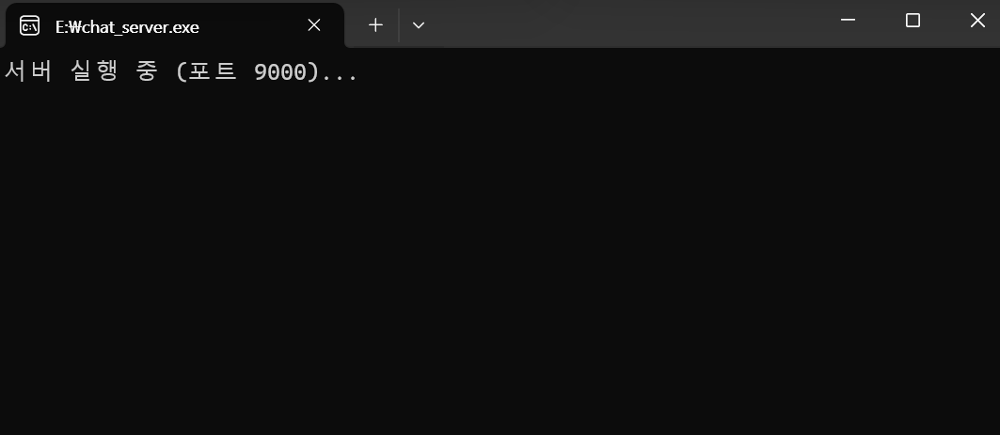
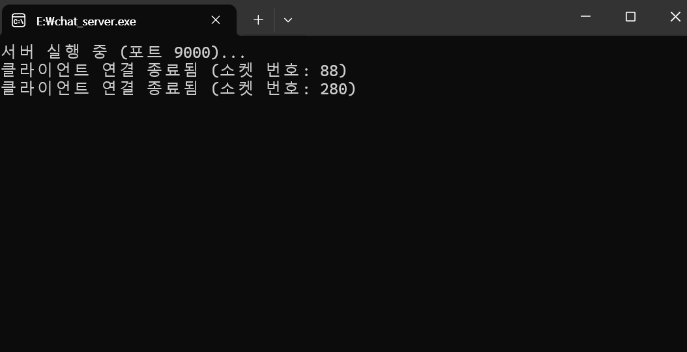

## 📂 프로젝트 구성

- `chat_server.c`: 서버 소스코드 (멀티 클라이언트 처리, 메시지 브로드캐스트)
- `chat_client.c`: 클라이언트 소스코드 (서버 접속 및 메시지 송수신)

---

## 🖼️ 실행 화면

### ✅ 클라이언트 화면

#### 💬 클라이언트 간 채팅

---

### ✅ 서버 화면

#### 🟢 서버 실행 화면

#### ❌ 클라이언트 퇴장 감지

